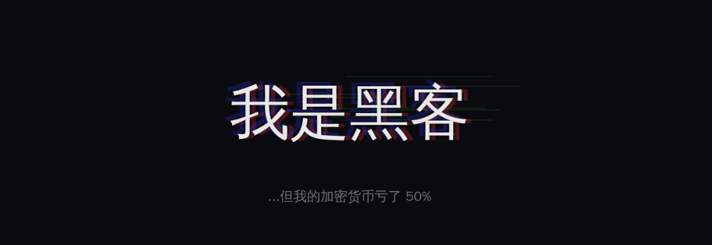

# Welcome to crj blog

是的，我已经厌倦了思考各种黑客或者极客风格的昵称，我将回归真我，实名制上网。我试图使用 LLM 来生成这个主页，但是我发现不是嘉豪再世就是宛如弱智。所以我决定手写。

## 研究领域

1、在这里，我们讲究出身。我是 Windows 出身，现在来看成分并不是很好，我也在积极的转向 linux 以及 macos。

1、在这里，我们讲究出身。我是 CTF 竞赛中的re、pwn手，但是毕业后已经够很久没有 pwn 的场景了，我用分析和挖掘漏洞来平替了pwn，**不忘初心**。

1、在这里，我们讲究出身。我是某安全公司的安全攻防工程师出身，在公司中，因为Windows+安全的性质，被打为5等公民，好处就是不会受到什么大的人员调度，坏处就是好事也很少轮到我们。。。。。。

## 研究方向

有些是业务研究方向，有些是个人研究方向。

- **终端攻防：** Windows是我的老家，但是这并不能表明我精通Windows攻防，只能说明 linux 和 macos 的能力还不如Windows。
- **ATT\&CK 映射：** 工作需要嘛，这个框架是抓手，但是不能全抓，因为他覆盖的太少了，只能提供思路和方向。
- **POC 、攻击链开发：** 工作需要嘛，谁没事闲的自己写样本，构建优势样本，比如我们能检出，友商检不出的那种。
- **EDR 研究**：现在没有哪个公司会支持你去做没有产出的研究，所有的研究都要赋能到产品上。
- **C2 框架：** 攻防不研究C2等于白攻防。没啥好说的。主要研究的是泄露的C2，因为没预算买正版的和新的。
- **恶意样本：** 分析恶意样本，也算是工作的非主要内容吧，分析样本的目的也是增强和评价安全效果。
- **终端漏洞：**  漏洞研究和业务没啥关系，属于个人爱好，发现了公司的杀毒驱动的BYOVD，还有VDI的剪切板的溢出漏洞等等，反馈了但是由于5等公民的原因，nobody care。关注hyperV的漏洞，我的直觉告诉我这里会有很多在野漏洞，可惜，claude毁了我的出路。
- **游戏对抗：  这里关注的是反反作弊检测，不是怎么定位血量偏移。谢谢**

## 精神状态

国内股市亏损：6%

国外股市亏损：5%

币圈亏损：50%
